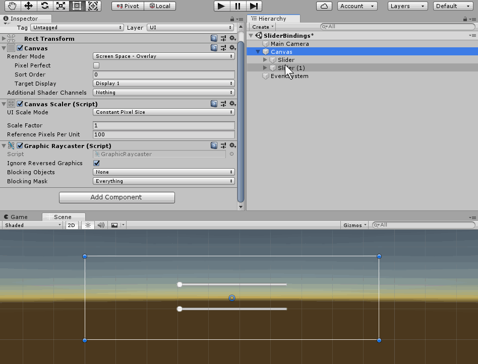

# BindingRx
Package for unity3d which allow make binding linke in MVVM pattern.  

## Features
 * One way, two way property/field binding
 * Not use AOT
 * Simple configuration
 * Zero-code using
 * *(in future)* integration with [UniRx](https://github.com/k0dep/UniRx)

## Showcase


## Code examples
Examples see in `%Package%/Examples` folder

## Using
For start using this package add lines into `./Packages/manifest.json` like next sample:  
```json
{
  "dependencies": {
    "bindingrx": "https://github.com/k0dep/bindingrx.git#1.0.0"
  }
}
```
Instead `#1.0.0` paste version what you need.

> **Warning!** For unity 2018.3, After include dependency in manifest,
> you must manual add [TypeInspector](https://github.com/k0dep/type-inspector) and [UniRx](https://github.com/k0dep/UniRx) dependencies in manifest